## 计算机毕业设计吊打导师hadoop+spark知识图谱知网文献推荐系统 论文推荐系统 知网论文可视化 知网论文数据分析 知网论文大数据 知网论文爬虫 知网论文预测 大数据毕业设计 大数据大数据毕设 大数据毕业设计 机器学习 深度学习 人工智能

## 要求
### 源码有偿！一套(论文 PPT 源码+sql脚本+教程)

简易

https://www.bilibili.com/video/BV1Vu411L7vU/?spm_id_from=333.999.0.0

详细

https://www.bilibili.com/video/BV1zm4y1j7wx/?spm_id_from=333.999.0.0

### 
### 加好友前帮忙start一下，并备注github有偿知网文档2024
### 我的QQ号是2827724252或者798059319或者 1679232425或者微信:bysj2023nb

# 

### 加qq好友说明（被部分 网友整得心力交瘁）：
    1.加好友务必按照格式备注
    2.避免浪费各自的时间！
    3.当“客服”不容易，repo 主是体面人，不爆粗，性格好，文明人。

适合地狱级难度，从头到尾吊打导师！

干死中国这帮杂种导师！完全弱智张口喷来喷去！吃屎东西！什么鸡巴技术不会就会用嘴写代码！可操死他妈把！那就用我的项目摩擦吊打他！

# 开发技术
大数据：spark、hadoop、echarts

Java后端：springboot+mybatis-plus

Vue前端：vue.js、element-ui

数据库：mysql、neo4j

算法：协同过滤算法、MLP模型、SVD神经网络混合推荐算法、KNN/CNN/GNN卷积神经 lstm情感分析模型

Python爬虫

# 特色/创新点
数据可视化大屏
知识图谱
推荐算法4种实现
预测算法
AI识别
短信
支付宝沙箱支付
爬虫采集知网数据
等等创新点

# 运行截图

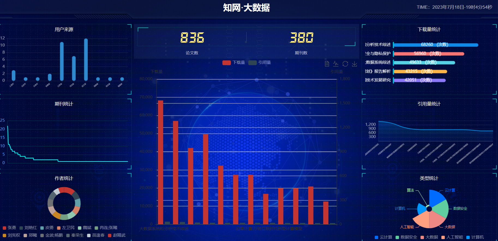

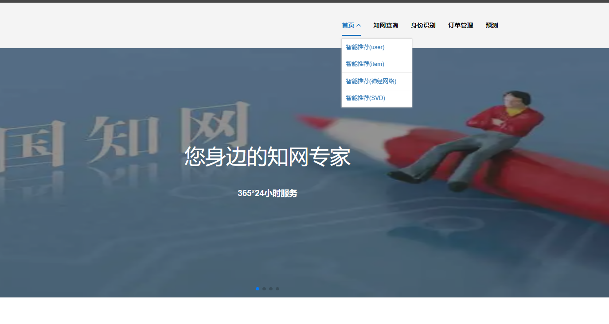

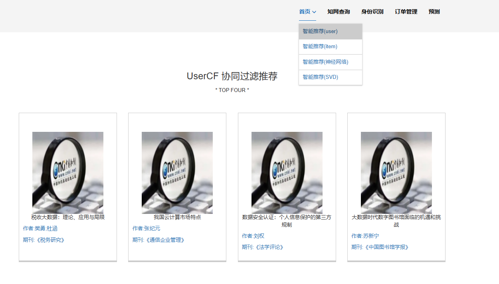

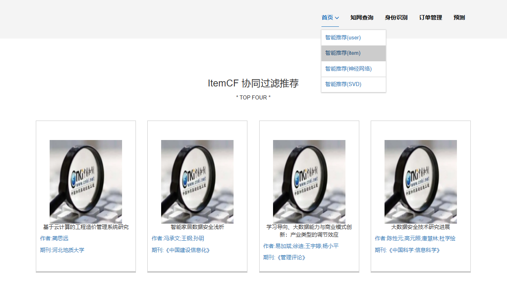

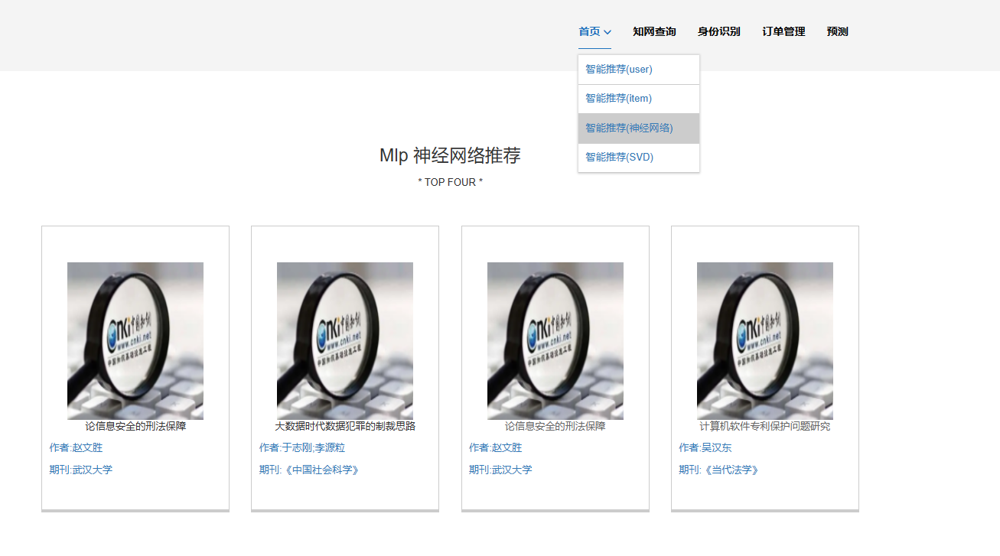

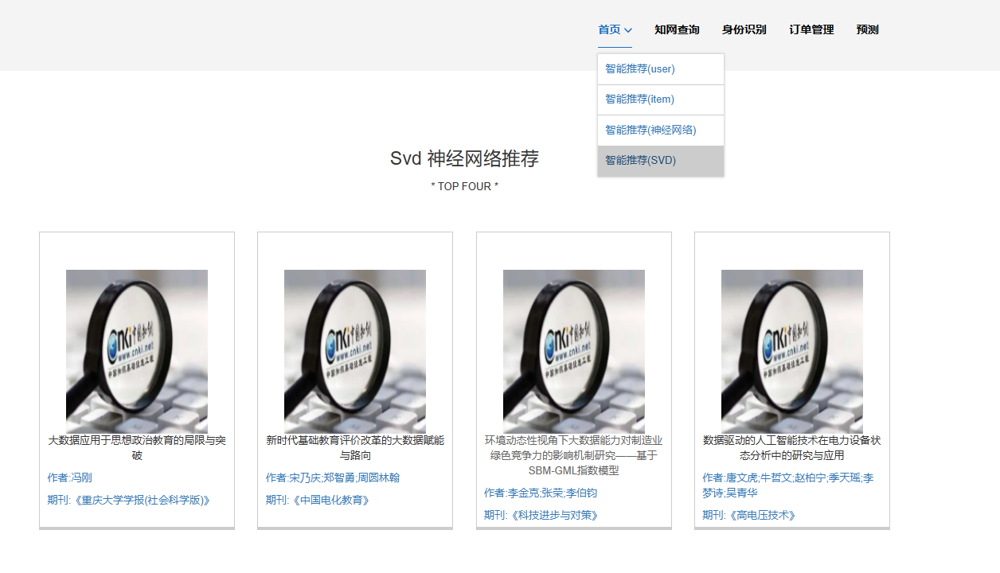

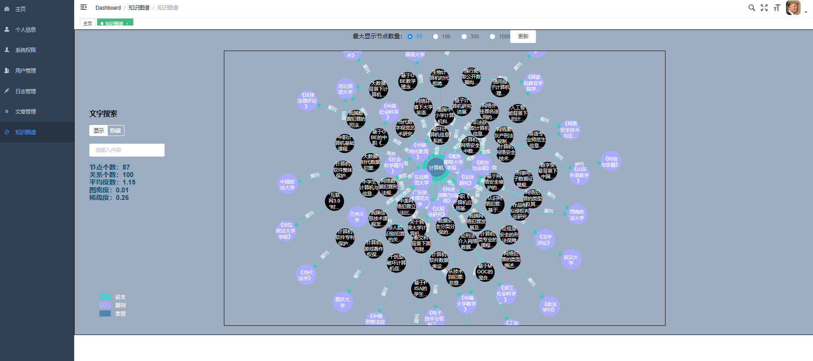

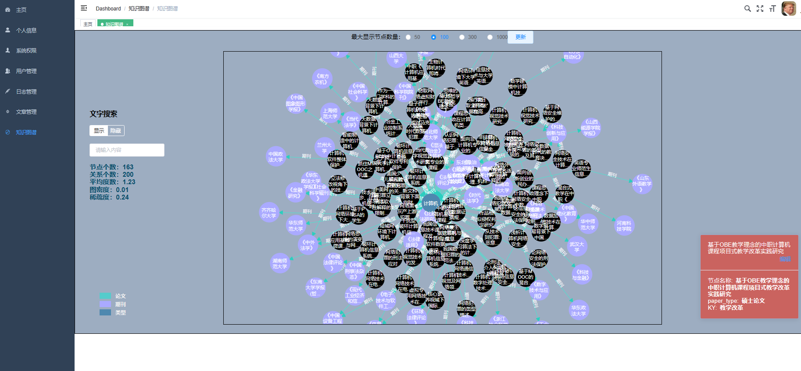

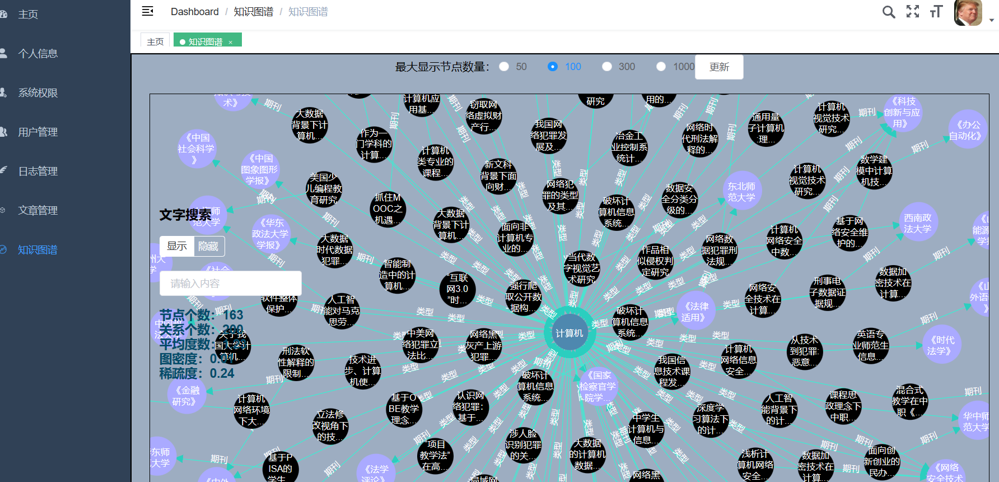

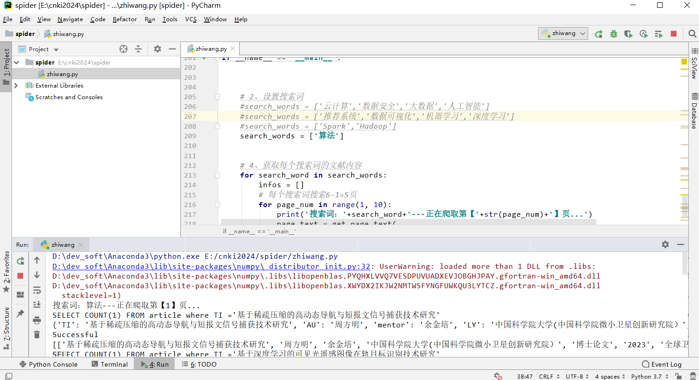

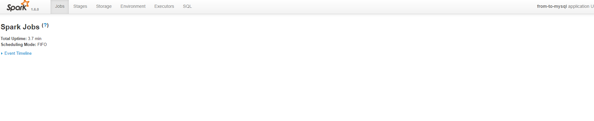

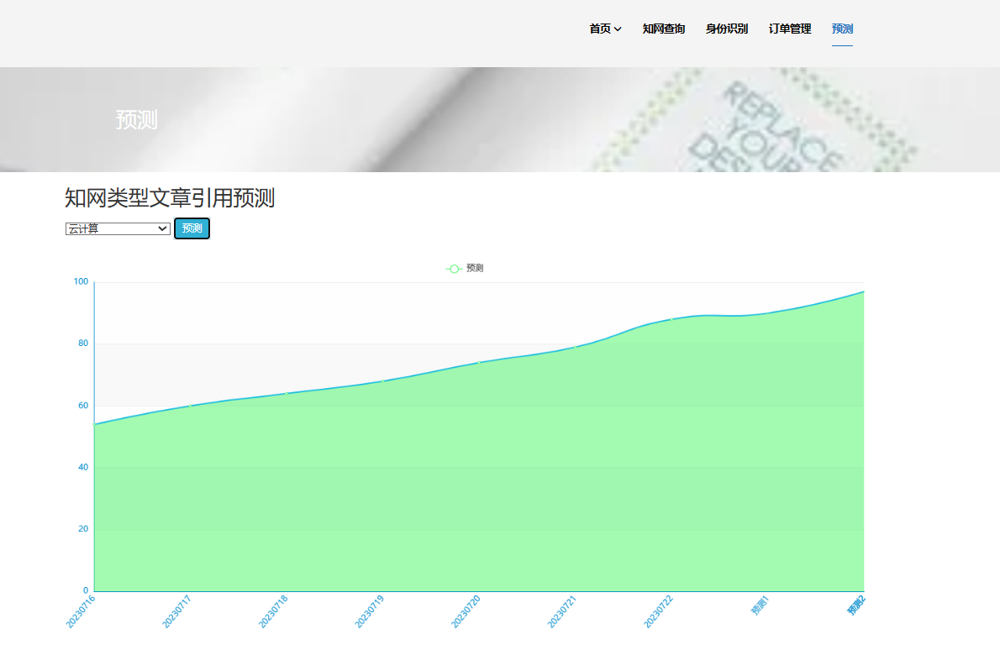

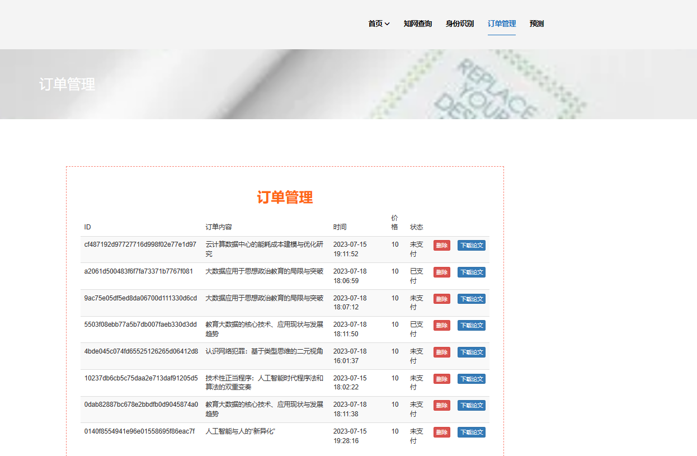

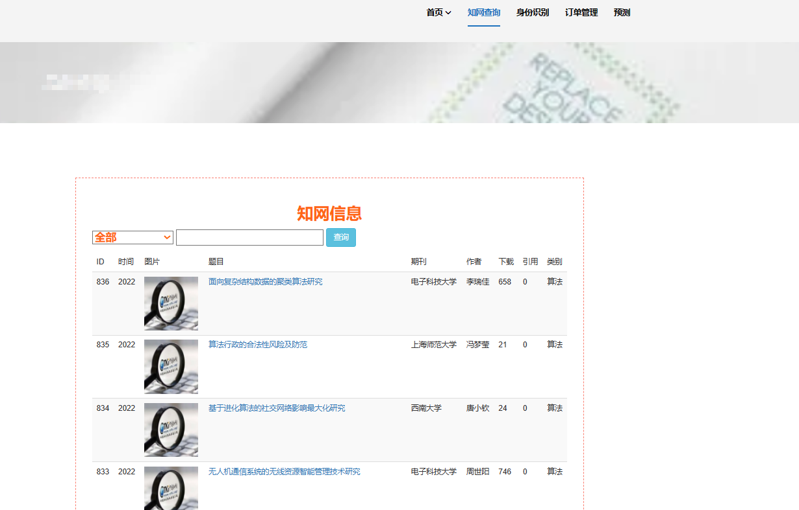

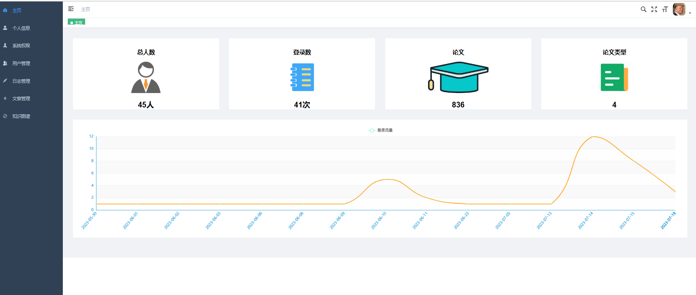

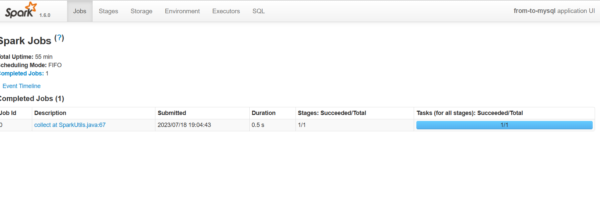

# 运行视频(B站)

简易

https://www.bilibili.com/video/BV1Vu411L7vU/?spm_id_from=333.999.0.0

详细

https://www.bilibili.com/video/BV1zm4y1j7wx/?spm_id_from=333.999.0.0

